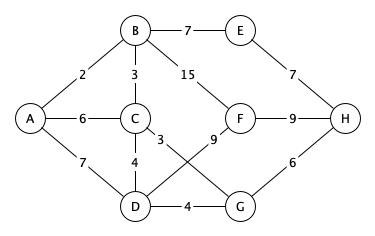

# Вариант 1

## Задание 1

> Дана сеть автомобильных дорог, соединяющих города Московской области. Некоторые дороги односторонние. Найти кратчайшие пути от города Москвы до каждого города области (если двигаться можно только по дорогам).

Напишите программу для поиска кратчайшего пути из вершины "А".
Программа должна выводить список вершин и кратчайшее расстояние до вершины.
Для самой удаленной вершины вывести кратчайший путь - последовательность врешин.

## Задание 2

Напишите программу для поиска максимального потока транспортной сети. Программа должна выводить значение максимального потока и список полностью заполненных ребер.

> Задача о максимальном потоке заключается в нахождении такого потока по транспортной сети, что сумма потоков из истока, или, что то же самое, сумма потоков в сток максимальна.
