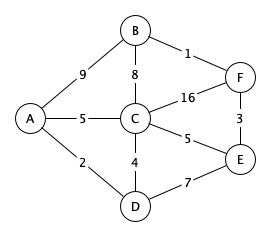

# Вариант 2

## Задание 1

Напишите программу для поиска кратчайшего пути из вершины "А".
Программа должна выводить список вершин и кратчайшее расстояние до вершины.
Для самой удаленной вершины вывести кратчайший путь - последовательность врешин.

> Воспользуйтесь алгоритмом Дейкстры

## Задание 2

Напишите программу для поиска максимального потока транспортной сети. Программа должна выводить значение максимального потока и список полностью заполненных ребер.

> Задача о максимальном потоке заключается в нахождении такого потока по транспортной сети, что сумма потоков из истока, или, что то же самое, сумма потоков в сток максимальна.

> Воспользуйтесь алгоритмом Форда-Фалкерсона

## Задание 3

Из колоды в 10 карты на удачу выбирается N карт. Сколькими способами это можно сделать?
Напишите программу которая выводит все возможные комбинации. Карты пронумированы числами от 0 до 9

### Входные данные

N - число карт

### Выходные данные

В первой строке выведите K - количество комбинаций. Далее K-строк, в каждой строке комбинацию карт.

### Пример

| Input | Output |
| ----- | ------ |
| 1     |  10   0   1   2   3   4   5   6   7   8   9 |
