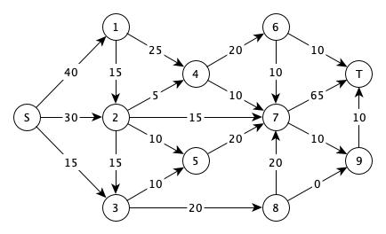

# Вариант 3

> Создайте публичный репозиторий. Загрузите решения в репозиторий. Для каждого задания используйте отдельную директорию с номером задания. Например решение первого задания должно находиться в директории с именем "1", итоговый путь к файлу решения должен выглядеть как "1/main.py".

> При выполнении последнего задания используйте модули, разбейте программу на несколько файлов. Основной файл с примером использования назовите "main.py". Для остальных файлов используйте имена соотвествующие названиям классов, которые содержатся в этих файлах.

## Задание 1

Напишите программу для поиска кратчайшего пути из вершины "А".
Программа должна выводить список вершин и кратчайшее расстояние до вершины.
Для самой удаленной вершины вывести кратчайший путь - последовательность врешин.

> Воспользуйтесь алгоритмом Дейкстры

## Задание 2

 Напишите программу для поиска максимального потока транспортной сети. Программа должна выводить значение максимального потока и список полностью заполненных ребер.

> Задача о максимальном потоке заключается в нахождении такого потока по транспортной сети, что сумма потоков из истока, или, что то же самое, сумма потоков в сток максимальна.

> Воспользуйтесь алгоритмом Форда-Фалкерсона

## Задание 3

В студенческой группе N человек. Сколькими способами можно выбрать старосту и его заместитиеля? Напишите программу, которая выводит все возможные комбинации.

### Входные данные

N - число человек в группе. N > 1

### Выходные данные

В первой строке выведите K - количество комбинаций. Далее K-строк, в каждой строке выведите два числа - номера старосты и его заместителя

### Пример

| Input | Output |
| ----- | ------ |
| 2     | 2   0 1   1 0 |
| 3     | 6   0 1   0 2   1 0   1 2   2 0   2 1 |

## Задание 4

При помощи методов ООП опишите предметную область.

> ООП - объектно-ориентированное программирование

### Описание предметной области

Производственный участок. Характеризуется наименованием, списком станков.

Станок. Характеризуется наименованием.

Продукт. Характеризуется наименованием.

Оператор станка. Характеризуется ФИО.

Производственная операция. Характеризуется станком, оператором, продуктом, количеством производимого продукта, временем начала и окончания.

### Реализация

Создайте необходимы классы, снабдите эти классы полями и методами. При необходимости добавьте свойста. Следите за сокрытием данных, защитой данных от измененния. Предусмотрите исключительные ситуации.

Создайте несколько экземпляров получившихся классов. Приведите пример использования.
